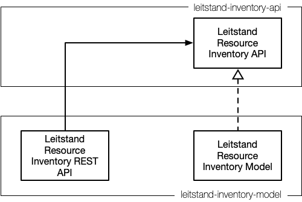

# Leitstand Resource Inventory API

The Leitstand Resource Inventory API is a _transactional_ to manage resource inventory records.

 

The [Leitstand Inventory Model](../leitstand-inventory-model/README.md) implements the Leitstand Resource Inventory API.
Other Leistand modules can either use the REST API or compile against the Leistand Inventory API. 
In the latter case the Leitstand module either includes the leitstand inventory model library to access the resource inventory database 
or uses an alternative API implementation that then again invokes the REST API. 
This approach allows to decide at the moment of application assembly how a Leitstand module technically interfaces with the Leitstand inventory.

## Services

The table below lists the Leitstand Resource Inventory API services.

| Service                         | Description                                                                                                                                  |
|:--------------------------------|:---------------------------------------------------------------------------------------------------------------------------------------------|
| CloneElementService             | Clones an element record for hardware replacement. The new serial number and MAC address is assigned to the clone.                           |
| DnsZoneService                  | Manages DNS zones.                                                                                                                           |
| ElementConfigService            | Manages element configurations.                                                                                                              |
| ElementDnsRecordSetService      | Manages DNS records per element.                                                                                                             |
| ElementEnvironmentService       | Manages environments per element. An environment is a set of variables (JSON object) and is passed to a configuration generator for example  |
| ElementGroupElementsService     | Queries elements of an element group.                                                                                                        |
| ElementGroupExportService       | Exports the general settings of each element group including the general settings of the group elements.                                     |
| ElementGroupRackService         | Manages the racks of an element group. This allows to describe the racks where the group elements are installed.                             |
| ElementGroupService             | Queries element groups.                                                                                                                      |
| ElementGroupSettingsService     | Manages element group settings.                                                                                                              |
| ElementImagesService            | Manages the software images installed on an element.                                                                                         |
| ElementLogicalInterfaceService  | Manages the logical interfaces of an element.                                                                                                |
| ElementMetricService            | Manages the metrics that can be sampled from an element.                                                                                     |
| ElementModuleService            | Manages the hardware modules of an element.                                                                                                  |
| ElementPhysicalInterfaceService | Manages the physical interfaces of an element.                                                                                               |
| ElementRackService              | Manages the rack installation points of an element.                                                                                          |
| ElementRoleService              | Manages the element roles (e.g. SPINE switch, LEAF switch).                                                                                  |
| ElementServicesService          | Manages the infrastructure services that run on an element (e.g. BGP daemon, Access daemon,...)                                              |
| ElementSettingsService          | Manages the general settings of an element (name, role, description, MAC address, serial number, management interfaces,...)                  |
| ImageExportService              | Exports software image metadata for all registered images.                                                                                   |
| ImageService                    | Manages sofware image metadata for all images that can be installed in the network.                                                          |
| MetricAlertRuleService          | Manages alert conditions per metric.                                                                                                         |
| MetricExportService             | Exports all existing metric definitions.                                                                                                     |
| MetricSettingsService           | Manages general metric settings (metric name, metric unit, metric scope, metric description).                                                |
| MetricVisualizationService      | Manages visualization configurations for a metric.                                                                                           |
| PackageService                  | Manages the packages shipped with an image.                                                                                                  |
| PhysicalInterfaceService        | Queries physical interfaces by their alias to quickly access a certain interface.                                                            |
| PlatformService                 | Manages the platforms elements are operating on.                                                                                             |
| RetireElementService            | Retires an element to remove it from the network eventually.                                                                                 |
| ServiceDefinitionService        | Manages the service definitions of all infrastructure services (e.g. BGP daemon definition).                                                 |

