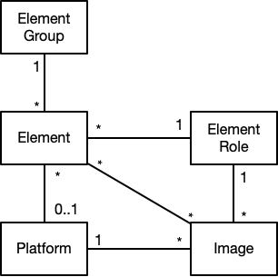

# Leitstand Resource Inventory Model

The _Leitstand Resource Inventory Model_ describes the _elements_ forming the transport network of a disaggregated access network.
The goal is to provide a _generalized model_, such that new kinds of elements can be added 
without modification of the [resource inventory data model](./doc/datamodel.md).

The basic idea is to describe elements and their respective _role_ in the network.
The role expresses the function of the element. 
Typical element roles are OLT, Leaf, or Spine for example.
It is also feasible to model virtual resources as an element.
A time series database containing sampled network element metric data is an example of a virtual resource.

The Leitstand Resource Inventory Model is devised for storing the data required to _manage_ and _monitor_ an element.

Leitstand can be considered as a disaggregated management system for a disaggregated access network, 
which means that management processes are implemented as dedicated applications.
A _Leitstand Application_ processes the inventory data to provide a certain management function,
such as link-state graph visualization, software upgrade, configuration management, or metric monitoring.
Consequently, each application needs to know the semantics of the data read from the resource inventory.

## Overview
The figure below shows the key entities of the Leitstand Resource Inventory and their relationships.

 
 

The `Element` entity forms the cornerstone of the resource inventory model and represents an element of the transport network.
Each `Element` belongs to _exactly_ one `ElementGroup`.
The element group is leveraged for event correlation, i.e. to fetch all log events of elements in the same group for a root cause analysis. The group name is stored as attribute of every log event and hence only a single element group membership is supported.
Each `Element` has a certain role, which is represented by the `ElementRole` entity.
A managed element is managed by Leitstand applications 
whereas an unmanaged element is stored for the sake of documentation only.

The `Metric` entity describes a metric that can be sampled from an element.
An element can provide multiple metrics and a metric can be provided by different elements.

The `Image` entity describes a software image that can be installed on an element.
An image is bound to an element role and to a platform.
Multiple images per element can be stored in the inventory.

The `Platform` entity describes the platform the element operates on. 

See the next sections for more details on what data is stored per entity, or proceed at the [complete data model documentation](datamodel.md) to learn all details about the resource inventory data model.

## Aggregate Root Entities

### Element
An element represents a single network element and its resources.

The following data is stored per element:

- **General Settings**, consisting of the element group membership, the unique, immutable element UUID, the element role, a unique element name, an optional unique element alias, the administrative state, the operational state, the platform, a list of management endpoints (e.g. REST API endpoint), the optional serial number, the optional MAC address of the management interface, the optional rack location of the element, an optional description, and optional tags to categorize an element.
- **Physcial Interfaces**, a list of physical interfaces containing the interface name, the interface alias (description), the MAC address, the administrative state, the operational state, the link neighbor (if any) and the bandwidth of each physical interface.
- **Logical Interfaces**, a list of logical interfaces defined on the element. Every logical interface is associated with a physcial interface. The inventory also stores the IP addresses and IP prefixes of the logical interface.
- **Services**, a list of services deployed on the element and their current status.
- **Configurations**, the element configurations including the history per configuration. The inventory maintains a configuration lifecycle state to differentiate between the currently active configuration, a candidate configuration and superseded configurations.
- **Images**, the installed software images.
- **Environment Variables**, a set of environments, each with a unique name and a JSON object, to feed templates to generate configurations.
- **Metrics**, the metrics sampled from the element. The time series data is stored in a specialized time series database (TSDB), but the inventory is aware of which time series shall be streamed to this TSDB.
- **DNS**, the DNS records of an element.
- **Hardware Modules**, a list of hardware modules intended for asset accounting and spare part management.

### Element Role
The element role describes the function of a network element.

Each element role has a unique name, a brief description and is assigned to to either the _data_, _management_, or _control plane_ of the access network.

### Element Group
An element group is a collection of elements.
Each element is member of exactly one group.

The following data is stored per element group:
- **General Settings**, consisting of the group type, the unique, immutable group UUID, the unique group name, an optional description, and optional tags to categorize a group.
- **Geolocation**, an optional group location consisting of the address along with the resolved longitude and latitude coordinates. 
- **Racks**, the racks that contain the elements of this group

__NOTE:__ The group membership of an element is stored in the element.

### Metric
A metric can be sampled from an element and is processed for network monitoring and capacity management.

The following data is stored per metric
- **Metric Name**, a unique metric name
- **Metric Unit**, the unit of the sampled values.
- **Description**, an optional description of the metric.
- **Element Roles**, the element roles that provide this metric.
- **Metric Scope**, expressing whether the metric is supplied for the entire element, a physical interface, a logical interface or a service.
- **Alert Rules**, to program alert conditions on specialized monitoring systems, whenever an alert condition is satisfied.
_ **Visualization Configuration**, to provision dashboards in specialized time serialization tools.

### Image
An image is a software image that can be installed on network elements.
The image binaries are not stored in the resource inventory, but read from a specialized image repository.
The following data is stored per image:
- **Organization**, the organization that has released the image.
- **Element Role**, the element role the image was built for.
- **Platform**, the platform the image was built for.
- **Image Type**, the image type such as Docker image, LXC image, VM image, or OS image.
- **Image State**, the image life cycle state, which is either _NEW_, _CANDIDATE_, _RELEASE_, _SUPERSEDED_, or _REVOKED_. The release image is installed by default. New and revoked images are not eligible for deployment. A new image typically becomes a candidate image, if it passes the integrity verification. A candidate image becomes the new release image, if it passes all tests. A supserseded image is an outdated release image, which has been replaced by a newer release. A revoked image must not be installed any longer.
- **Image Name**, an arbitrary image name to differentiate between images.
- **Checksums**, an optional set of checksums like a MD5, SHA-256, or SHA-512 checksum.
- **Version**, the image version. The resource inventory supports the semantic versioning scheme, which consists of a _major version number_, a _minor version number_, a _patch level_, and an optional _prerelease_ label (e.g. `1.0.0-alpha` < `1.0.0-beta` < `1.0.0`)
- **Build Date**, the image build date.
- **Packages**, the list of packages that are shipped with the image. Each package consists of the organization that released the package, the package name, the package version, optional checksums,  
- **Applications**, the list of applications that can be enabled for the image.

### Platform
A platform is the runtime environment for an element. 
The software image of an element is always built for a specific element role that runs on a certain platform.

The following data is stored per platform:
- **Vendor Name**, the name of the platform vendor
- **Model Name**, the name of the platform model
- **Description**, an optional description of the platform.
- **Dimensions**, the optional height of the platform in rack units and whether the platform is a half-rack device.

## Scopes

The following scopes exists to grant access to resource inventory records.

| Scope                 | Description                                                                                 |
|:----------------------|:--------------------------------------------------------------------------------------------|
|_ivt_                  | Full access to all inventory records.                                                       |
|_ivt.read_             | Readonly access to all inventory records.                                                   |
|_ivt.element_          | Manage element records.                                                                     |
|_ivt.element.settings_ | Manage element settings including element role and element platform settings.               |
|_ivt.element.dns_      | Manage element DNS records and DNS zones.                                                   |
|_ivt.element.config_   | Manage element configurations and variable sets used to generate configuration.             |
|_ivt.element.module_   | Manage element module information.                                                          |
|_ivt.group_			| Manage element group records.                                                               |
|_ivt.group.settings_	| Manage element group settings (i.e. user is not allowed to add/remove elements to a group). |
|_ivt.metric_			| Manage metric definition records.                                                           |
|_ivt.image_			| Manage software image records.                                                              |

