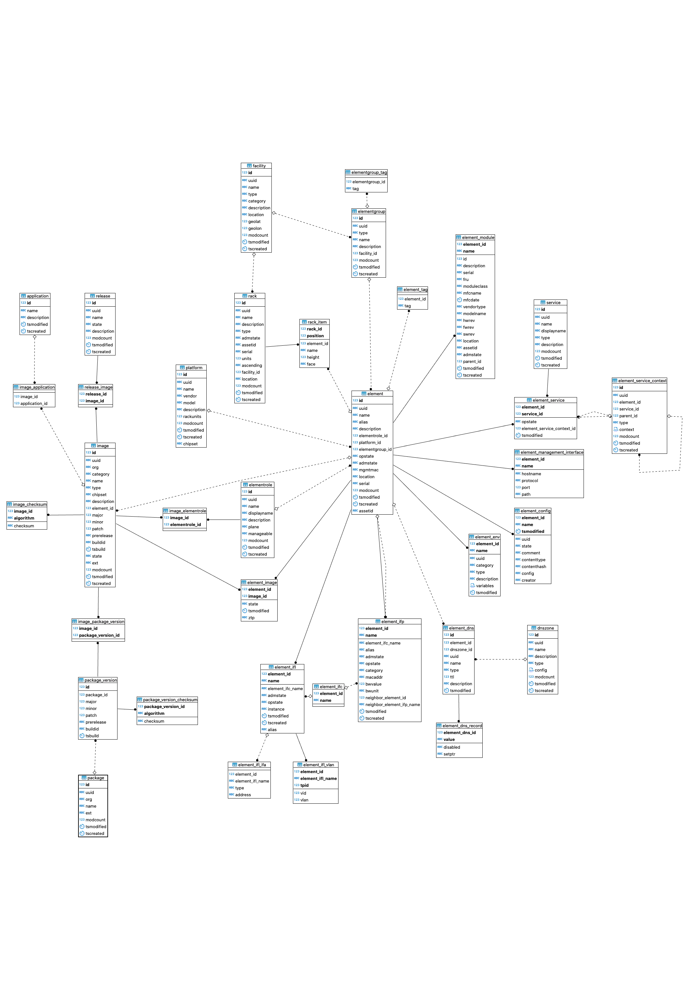

# Leitstand Resource Inventory Database Model

This document describes the data model of the _Leitstand Resource Inventory Database_, 
which is a is a relational database.

## Conventions

This section describes basic conventions of the Leitstand resource inventory database model.

### Database Schema

__Convention:__ _All Leitstand Resource Inventory database artefacts are located in the `inventory` schema._

### Aggregates

An aggregate is a set of entities that represent an object structure.
The _aggregate root entity_ represents the root object of this structure.
The aggregate root entity and the remaining entities form a _composition_,
which means that the lifecycle of sub-resource entities is bound to the lifecycle of the aggregate root entity.

For example, `element` is an aggregate root entity and `element_config` represents the configuration sub-resource of an element.
An element configuration record cannot exist without correspondingelement record, whereas an element record can exist without configuration record.
This is typcially the case when adding a new element to the inventory.

An aggregate has a unique ID that can be used as external reference.

__Convention:__ _The aggregate root ID is a Universal Unique ID (UUID) in V4 format._

__Convention:__ _The aggregate root UUID is globally unique and identifies an aggregate root entity unambiguously._

__Convention:__ _The aggregate root UUID is immutable._

__Convention:__ _An aggregate root UUID must not be reused._

In summary, an aggregate root UUID is unique among all aggregate root entities for all time.

__Convention:__ _The aggregate root UUID is stored in the `UUID` column. The column type is `CHARACTER(36)`._

It is sometimes handy to know when an aggregate was created and an aggregate was last modified.
Hence every aggregate stores the last modification and creation timestamps.

__Convention:__ _The creation date of the aggregate is stored in the `TSCREATED` column. The column type is`TIMESTAMP`._

__Convention:__ _The last-modification date of the aggregate is stored in the `TSMODIFIED` column. The column type is `TIMESTAMP`._

The relation between an aggregate root entity and its sub-resource entities are described by foreign keys to guarantee referential integrity and avoid orphaned records.

__Convention:__ _The primary key of an aggregate root entity is formed by a contiguous number._

The primary key is used to model the relations between the aggregate root entity, the sub-resource entities, or other aggregates but must not be exposed to Leitstand resource inventory clients. 
Clients use the UUID to access a particular aggregate.

__Convention:__ _The primary key is stored in the `ID` column. The column type is `INT8` (`BIGINT`)._

A naming convention simplifies the identification of the tables forming an aggregate.

__Convention:__ _The name of a sub-resource table consists of the aggregate root table name followed by an underscore and the sub-resource name._

For example, if `element` is the name of the aggregate root table, then  `element_config`, `element_ifp`, or `element_module` are examples for sub-resource table names.


### Foreign Keys

Foreign keys describe the relations between entities and guarantee _referential integrity_.
A proper naming scheme simplifies to identify foreign keys without the need to query the data model.

__Convention:__ _The name of a column used to build a foreign key relation starts with the target table name followed by an underscore and the target column._

For example, the `ELEMENT_ID` column refers to the `ID` column of the `element` table.

This convention also simplifies writing `JOIN` clauses in SQL statements, 
because the column names to join two tables can be derived from the table names using this convention.

### Optimistic Locking

The Leitstand Resource Inventory prefers _optimistic locking_ over _pessimistic locking_.

The resource inventory uses modification counter to facilitate optimistic locking.
The modificaton counter is incremented with every resource modification.

__Convention:__ _The `MODCOUNT` column stores the number of modifications. The column type is `INT4` (`INTEGER`)._

The aggregate root entity contains the modification counter for the entire aggregate. 
The modification counter needs not be incremented if a concurrent modification of sub-resources is permitted.

#### Optimistic Locking in a Nutshell
The basic idea of optimistic locking is to increment a modification counter with every record update.
This allows to _detect_ concurrent modifications by means of comparing the modifications count values rather than preventing concurrent modifications by locking the record when being read.
Less locking improves concurrency.
A concurrent update has taken place, if the modification counter was changed after the transaction has read the record.

Optimistic locking imposes that the `WHERE` clause includes the expected modifications count and that the modification counter gets incremented.

The listing below shows a SQL statement that makes use of optimistic locking:

```SQL
UPDATE inventory.element e
SET name='NEW', 
    modcount=2
WHERE e.id=1      # Primary key of the element record
AND e.modcount=1  # Modification counter when record was read
```
The update was successful if the statement updated a single row, the element record.
A concurrent update occurred, or the element record does not exist, if no record was updated.

## Tables

This section outlines all tables of the Leitstand Resource Inventory database.

### Entity-Relationship Diagram

The figure below shows the _[Entity Relationship Diagram](./assets/er-diagram.png "Resource Inventory Entities")_ of the resource inventory entities.

 


### `application` Table
The `application` table stores all applications that can be enabled on network elements.
Which applications can be enabled on a particular element depends on the installed software image.
The `image_application` table stores which applications an image supports.

#### Columns

| Column 	  | Type 		  | Description 					   			|
|:------------|:--------------|:----------------------------------------|
| ID		 	  | INT8 		  | Sequential number as primary key.		|
| UUID		  | CHARACTER(36) | Unique application ID in UUIDv4 format. |
| NAME   	  | VARCHAR(64) 	  |	Unique application name.					|
| DESCRIPTION | VARCHAR(1024) | Optional application description.		|
| MODCOUNT 	  | INT4 		  | Modification counter. 					|
| TSMODIFIED  | TIMESTAMP 	  | Last-modification timestamp.				|
| TSCREATED 	  | TIMESTAMP 	  | Creation timestamp.						|

#### Primary Key
The `ID` column forms the primary key.

#### Unique Constraints
Unique constraints exist on the following columns:
- `UUID`, the application ID must be unique for all applications
- `NAME`, the application name must be unique for all applications

### `dnszone` Table
The `dnszone` table contains the configured DNS zones to provision a DNS server.

#### Columns
| Column 	  | Type 		  | Description 					   			|
|:------------|:--------------|:----------------------------------------|
| ID		 	  | INT8 		  | Sequential number as primary key.		|
| UUID		  | CHARACTER(36) | Unique DNS zone ID in UUIDv4 format.    |
| NAME   	  | VARCHAR(64) 	  |	Unique DNS zone name.					|
| DESCRIPTION | VARCHAR(1024) | Optional DNS zone description.		    |
| TYPE		  | VARCHAR(128)  | Optional configuration type information.|
| CONFIG		  | JSON			  | Optional DNS zone settings.             |
| MODCOUNT 	  | INT4 		  | Modification counter. 					|
| TSMODIFIED  | TIMESTAMP 	  | Last-modification timestamp.				|
| TSCREATED 	  | TIMESTAMP 	  | Creation timestamp.						|

#### Primary Key
The `ID` column forms the primary key.

#### Unique Constraints
Unique constraints exist on the following columns:
- `UUID`, the application ID must be unique for all applications
- `NAME`, the application name must be unique for all applications

### `element` Table
The `element` table forms the element aggregate root and contains general element settings.

#### Columns
| Column 			| Type 			| Description 							|
|:------------------|:--------------|:--------------------------------------|
| ID     			| INT8			| Sequential number as primary key.	   	|
| UUID   			| CHARACTER(36)	| Unique element ID in UUIDv4 format.  	|
| NAME 				| VARCHAR (255)	| Unique element name. 					|
| ALIAS 				| VARCHAR(255)	| Optional, unique element alias. 		|
| ELEMENTROLE_ID    | INT8			| Reference to the element role record.	|
| PLATFORM_ID    	| INT8			| Reference to the platform record.		|
| ELEMENTGROUP_ID	| INT8			| Reference to the element group record.	|
| DESCRIPTION 		| VARCHAR(1024) 	| Optional element description. 			|
| OPSTATE 			| VARCHAR(16)	| Operational state of the element.		|
| ADMSTATE 			| VARCHAR(16)   | Administrative state of the element.	|
| MGMTMAC 			| CHARACTER(17) | Management interface MAC address.		|
| SERIAL 			| VARCHAR(255)  | Serial number of the element.			|
| MODCOUNT 			| INT4 			| Modification counter.					| 			
| TSMODIFIED 		| TIMESTAMP 		| Last-modification timestamp.			|
| TSCREATED 			| TIMESTAMP 		| Creation timestamp.					|

The following administrative states exist:
- `NEW` a new element that is about to be installed in the network.
- `ACTIVE` an element that is installed in the network.
- `RETIRED` an element that is about to be removed from the network.

The following operational states exist:
- `UP` the element is up and running. Each element is responsible to declare itself up.
- `DOWN` the element is down, but still might be accessible through the management system. Each element is responsible to declare itself down.
- `MAINTENANCE`the element is in maintenance mode. There is a potential impact on customer services, but alerts can be ignored.
- `DETACHED` no heartbeat received from the element and hence the state is unknown.

#### Primary Key
The `ID` column forms the primary key.

#### Unique Constraints
Unique constraints exist on the following columns:
- `UUID`, the element ID must be unique for all elements.
- `NAME`, the element name must be unique for all elements.
- `ALIAS`, the element alias must be unique for all elements.

In addition, the inventory service ensures that names and aliases do not match either.
Name and alias can only be equal for the same element, i.e. it is supported to store an element with the same name and alias.
This constraint is needed because element name and alias can be used _mutually_ to search for elements.
Without this restriction, a search by element name (or alias) could return two elements, which results in a violation of the unique constraint that exists for both, the name and the alias column. 
 
#### Foreign Keys
This table has three foreign keys:
- The `ELEMENTGROUP_ID` column refers to the `ID` column of the `elementgroup` table. 
  This relation models the element group membership.
- The `PLATFORM_ID` column refers to the `ID` column of the `platform` table. 
  This relation assigns the element to a certain platform.
- The `ELEMENTROLE_ID` column refers to the `ID` column of the `elementrole` table. 
  This relation assigns the element to its role.

### `element_config` Table
The `element_config` contains element configurations including the element configuration history.

#### Columns
| Column 			| Type 			| Description 																		|
|:------------------|:--------------|:----------------------------------------------------------------------------------|
| ELEMENT_ID     	| INT8			| Reference to the element record.													|
| UUID   			| CHARACTER(36)	| Unique configuration ID in UUIDv4 format.     										|
| NAME 				| VARCHAR(255)	| The configuration name. The configuration name is unique per element.				|
| CREATOR			| VARCHAR(255)  	| The creator of the configuration.													|
| COMMENT 			| VARCHAR(255)	| Optional comment of the configuration change. 										|
| STATE				| VARCHAR(16)   | Configuration state.																|
| CONTENTHASH	    | CHARACTER(32)	| MD5 hash of the configuration content												|
| CONTENTTYPE    	| CHARACTER(32)	| Configuration content-type, which can be any text format (e.g. `application/json`).	|
| CONFIG				| TEXT			| Configuration content.																|
| TSMODIFIED 		| TIMESTAMP 		| Last-modification timestamp.														|


The following configuration states exist:
- `ACTIVE` for the currently active configuration, 
- `SUPERSEDED` for an out-dated configuration, and
- `CANDIDATE` for a drafted configuration.

The configuration is stored using the content-addressed storage principle.
The configuration content hash value is used as unique key.
The following rules are applied when storing a new configuration:
- A candidate configuration is declared as active, if the reported active configuration matches the candidate configuration.
- A active configuration is declared superseded, if the reported active configuration does not match the stored active configuration.
- A candidate configuration remains the candidate configuration, if an active configuration is reported that does not match the candidate configuration.

#### Primary Key
The `ELEMENT_ID`, `NAME` and `TSMODIFIED` columns form the primary key.

#### Unique Constraints
The value of the `UUID` column must be unique, 
i.e. the configuration ID is unique for all configurations.

#### Foreign Keys
The `ELEMENT_ID` column refers to the `ID` column of the `element` table.
This relation assigns a configuration to its element.

### `element_dns` Table
The `element_dns` table refers to the DNS records for an element and to the respective DNS zone.

#### Columns
| Columns     | Type          | Description                                            |
|:------------|:--------------|:-------------------------------------------------------|
| ID          | INT8          | Sequential number as primary key.                      |
| ELEMENT_ID  | INT8          | Reference to the element record.                       |
| DNSZONE_ID  | INT8          | Reference to the DNS zone record.                      |
| UUID        | CHARACTER(36) | Unique element DNS entry ID in UUIDv4 format.          |
| NAME        | VARCHAR(64)   | The DNS record name.                                   |
| TYPE        | VARCHAR(16)   | The DNS record type.                                   |
| TTL         | INT4          | Optional time-to-live of the DNS record in DNS caches. |
| DESCRIPTION | VARCHAR(1024) | Optional DNS record description.                       |
| TSMODIFIED  | TIMESTAMP     | Last modification date of the DNS record.              |

#### Primary Key
The `ID` column forms the primary key.

#### Unique Constraints
This table has two unique constraints:
- The value of the `UUID` column must be unique.
- The value of the `NAME` column must be unique.

#### Foreign Keys
This table has two foreign keys:
- The `ELEMENT_ID` column refers to the `ID` column of the `element` table.
- The `DNSZONE_ID` column refers to the `ID` column in the `dnszone` table.

#### `element_dns_record` table
The `element_dns_record` table contains the values of a DNS record.

#### Columns
| Columns          | Type          | Description                                                                        |
|:-----------------|:--------------|:-----------------------------------------------------------------------------------|
| ELEMENT\_DNS\_ID | INT8          | Sequential number as primary key.                                                  |
| VALUE            | VARCHAR(128   | The DNS value.                                                                     |
| DISABLED         | CHAR(1)       | Flag to indicate whether this value is disabled (Y) or not (N).                    |
| SETPTR           | CHAR(1)       | Flag to indicate whether to create (Y) a Pointer Resource Record (PTR) or not (N). |
#### Primary Key
The `ELEMENT_DNS_ID` column and the `VALUE` column form the primary key.

#### Foreign Keys
The `ELEMENT_DNS_ID` column refers to the `ID` column of the `element_dns` table.


### `element_env` Table
The `element_env` table contains environment variables per element.
The environment variables are fed into configuration template engines in order to generate element configurations.

#### Columns
| Column 		| Type 			| Description 							  |
|:--------------|:--------------|:----------------------------------------|
| ELEMENT_ID    | INT8		    | Reference to the element record.		  |
| UUID			| CHARACTER(36) | Unique environment ID in UUIDv4 format. |
| NAME			| VARCHAR(64)   | Unique environment name. 				  |
| DESCRIPTION	| VARCHAR(1024) | Optional environment description.		  |
| VARIABLES		| JSON			| Environment variables as JSON object.   |
| TSMODIFIED		| TIMESTAMP		| Last-modification timestamp.			  |

The environment name is unique per element.

#### Primary Key
The `ELEMENT_ID` and `NAME` columns form the primary key.

#### Unique Constraints
The value of the `UUID` column must be unique, i.e.
the environment ID is unique for all environments.

#### Foreign Keys
The `ELEMENT_ID` column refers to `ID` column of the `element` table.
This relation assigns an environment to its element.

### `element_ifc` Table
The `element_ifc` table is a join table to connect the physical interfaces table (`element_ifp`) with logical interfaces table (`element_ifl`).
Physical interfaces and logical interfaces form a many-to-many relationship.
Multiple logical interfaces can be defined on the same physical interface.
Physical interfaces can be aggregated so that a logical interface can leverage multiple physical interfaces.

#### Columns
| Column  	 | Type        | Description 					 |
|:-----------|:------------|:--------------------------------|
| ELEMENT_ID	 | INT8		   | Reference to the element record.|
| NAME 		 | VARCHAR(16) | Container interface name. 		 |

The container interface name is unique per element.

#### Primary Key
The `ELEMENT_ID` and `NAME` columns form the primary key.

#### Foreign Keys
The `ELEMENT_ID` column refers to `ID` column of the `element` table.
This relation assigns a container interface to its element.

### `element_ifl` Table
The `element_ifl` table stores the logical interfaces per element.

#### Columns
| Column 	 				  | Type          | Description 							         |
|:----------------------------|:--------------|:---------------------------------------------|
| ELEMENT_ID	 				  | INT8			  | Reference to the element record.			     |
| ELEMENT\_IFC_NAME 			  | VARCHAR(16)	  | Reference to the container interface record. |
| NAME 						  | VARCHAR(16)	  | Logical interface name. 						 |
| ALIAS 						  | VARCHAR(255)	  | Optional logical interface alias. 			 |
| ROUTING_INSTANCE			  | VARCHAR(255)	  | Routing instance name.						 |
| ADMSTATE 					  | VARCHAR(16)	  | Logical interface administrative state.		 |
| OPSTATE 					  | VARCHAR(16    | Logical interface operational state.			 |
| TSMODIFIED 				  | TIMESTAMP 	  | Last-modification timestamp. 				 |
| TSCREATED 					  | TIMESTAMP	  | Creation timestamp. 							 |

The logical interface name is unique per element.

The following operational states exist:
- `UP`, the physical link is established.
- `DOWN`, the physical link is not established.

The following administrative states exist:
- `UP`, the physical link is enabled.
- `DOWN`, the physical link is disabled.

#### Primary Key
The `ELEMENT_ID` and `NAME` columns form the primary key.

#### Foreign Keys
This table has two foreign keys:
- The `ELEMENT_ID` column refers to the `ID` column of the `element` tables.
  This relation assigns a logical interface to its element.
- The `ELEMENT_ID` and `ELEMENT_IFC_NAME` columns form a composite foreign key that refers to the `ELEMENT_ID` and `NAME` columns in the `element_ifc` table.
  This relation assigns a logical interface to its container interface and by that to the physical interface.

### `element_ifl_ifa` Table
The `element_ifl_ifa` tables stores the IP addresses assigned to a logical interface.

#### Columns
| Column 			| Type        | Description                         |
|:------------------|:------------|:------------------------------------|
| ELEMENT_ID 		| INT8 	      | Reference to the element record.    | 
| ELEMENT\_IFL_NAME | VARCHAR(64) | Reference to the logical interface. |
| TYPE	  	 		| VARCHAR     | IP address type.                    |
| ADDRESS 			| VARCHAR     | IP address in CIDR notation.        |

The address type is either `IPV4` or `IPV6`.
The address is specified in CIDR notation, 
which is formed by the IP address followed by a slash (`/`) as delimiter and the prefix length expressing the number of leading bits forming the subnet mask. 
For example, the subnet mask `255.255.255.0` and IP address `192.168.0.2` is expressed as `192.168.0.2/24` in CIDR notation.

#### Primary Key
This table has no declared primary key which means that all columns form an implicit primary key.

#### Foreign Keys
The `ELEMENT_ID` and `ELEMENT_IFL_NAME` columns form a composite key that refers to the `ELEMENT_ID` and `NAME` columns in the `element_ifl` table.
This relation assigns an address interface to its logical interface.


### `element_ifl_vlan` Table
The `elemement_ifl_vlan` table contains the VLAN-IDs per logical interface.

#### Columns
| Column     		| Type        | Description 								   |
|:------------------|:------------|:-------------------------------------------|
| ELEMENT_ID        | INT8		  | Reference to the element record.			   |
| ELEMENT\_IFL_NAME | VARCHAR(64) | Reference to the logical interface record. |
| TAG				| INT4 		  | The tag position in the VLAN stack.   	   | 
| VLANID				| INT4		  | The VLAN ID.								   |

The `TAG` column is `null` for single-tagged VLANs.
For double-tagged VLANs, the `TAG` column value is `0` for the C-Tag VLAN-ID (inner VLAN) and `1` for the S-Tag VLAN-ID (outer VLAN).
For stacked VLANs with more than two tags, the `TAG` column value `0` identifies the C-Tag VLAN-ID, whereas all values > 0 identify the stacked S-Tags VLAN-IDs and their respective position in the VLAN stack.

#### Primary Key
The `ELEMENT_ID`, `ELEMENT_IFL_NAME` and `TAG` columns form the primary key.

#### Foreign Key
The `ELEMENT_ID` and `ELMENT_IFL_NAME` columns form a composite foreign key that refers to the `ELEMENT_ID` and `NAME` columns in the `element_ifl` table.
This relation assigns a VLAN to its logical interface.

### `element_ifp` Table
The `element_ifp` table stores the physical interfaces per element.

#### Columns
| Column 	 				  | Type          | Description 									|
|:----------------------------|:--------------|:--------------------------------------------|
| ELEMENT_ID	 				  | INT8			  | Reference to the element record.				|
| ELEMENT\_IFC_NAME 			  | VARCHAR(16)	  | Container interface name (foreign key).	 	|
| NAME 						  | VARCHAR(16)	  | Physical interface name. 					|
| ALIAS 						  | VARCHAR(255)	  | Optional physical interface alias. 			|
| CATEGORY 					  | VARCHAR(32)	  | Optional physical interface classification. |
| ADMSTATE 					  | VARCHAR(16)	  | Physical interface administrative state. 	|
| OPSTATE 					  | VARCHAR(16    | Physical interface operational state.		|
| MACADDR   				      | VARCHAR(17)   | Physical interface MAC address. 				|
| BWVALUE 					  | FLOAT4		  | Physical interface bandwidth value. 			|
| BWUNIT  					  | CHARACTER(4)	  | Physical interface bandwidth unit. 			|
| NEIGHBOR\_ELEMENT_ID 		  | INT8			  | Referehce to neighbor element record.	 	|
| NEIGHBOR\_ELEMENT\_IFP_NAME | VARCHAR(16) 	  | Physical neighbor interface name.			|
| TSMODIFIED 				  | TIMESTAMP 	  | Last-modification timestamp. 				|
| TSCREATED 					  | TIMESTAMP	  | Creation timestamp. 							|

The physical interface name is unique per element.

The following bandwidth units exist:
- `TBPS` for terabits per seconds.
- `GBPS` for gigabits per seconds.
- `MBPS` fpr megabits per seconds.
- `KBPS` for kilobits per seconds.

The following operational states exist:
- `UP`, the physical link is established.
- `DOWN`, the physical link is not established.

The following administrative states exist:
- `UP`, the physical link is enabled.
- `DOWN`, the physical link is disabled.

#### Primary Key
The `ELEMENT_ID` column and the `NAME` column form the primary key.

#### Foreign Keys
The `ELEMENT_ID` column refers to `ID` column of the `element` table.
This relation assigns an environment to its element.

### `element_image` Table
The `element_image` table stores which images are installed on the existing network elements.

#### Columns
| Column 	 | Type 		   | Description 					  |
|:-----------|:------------|:---------------------------------|
| ELEMENT_ID | INT8 		   | Reference to the element record. |
| IMAGE_ID	 | INT8 		   | Reference to the image record.   |
| STATE		 | VARCHAR(16) | Image installation state. 		  |
| TSMODIFIED | TIMESTAMP   | Last-modification timestamp. 	  |

The following image installation states exists:
- `ACTIVE`, the image is installed and currently active.
- `CACHED`, the image is cached on the local disk and can be instantly activated.
- `PULL`, the element needs to pull the image from the image repository in order to make it eligible for activation.

#### Primary Key
The `ELEMENT_ID` and `IMAGE_ID` columns form the primary key.

#### Foreign Keys
This table has two foreign keys:
- The `ELEMENT_ID` column refers to the `ID` column of the `element` table.
  This relation binds an installed image to the element where it is installed.
- The `IMAGE_ID` column refers to the `ID` column of the `image` table.
  This relation binds an installed image to the image record that describes the installed image.

### `element_management_interface` Table
The `element_management_interface` table stores management endpoints per element.
A REST-API endpoint URL is an example of a management endpoint.

#### Columns

| Column 	 | Type 			| Description 						|
|:-----------|:-------------|:----------------------------------|
| ELEMENT_ID	 | INT8			| Reference to the element record.	|
| NAME		 | VARCHAR(64)  | Management endpoint name.			|
| PROTOCOL	 | VARCHAR(16)  | Management endpoint protocol.		|
| HOSTNAME	 | VARCHAR(255) | Management endpoint hostname.		|
| PORT		 | INT4			| Optional management endpoint port.|
| PATH		 | VARCHAR(64)	| Optional management endpoint path.|

Typical protocols are _http_, _https_, or _ssh_.
The latter is needed to open a terminal emulator.

#### Primary Key
The `ELEMENT_ID` and `NAME` columns form the primary key.

#### Foreign Keys
The `ELEMENT_ID` column refers to `ID` column of the `element` table.
This relation assigns an environment to its element.

### `element_module` Table
The `element_module` table stores the hardware modules per element.
The modules are stored for the sake of documentation and can be leveraged for asset accounting and spare part management.

#### Columns
| Column 	   | Type 		   | Description 							  									  |
|:-------------|:--------------|:-----------------------------------------------------------------------------|
| ID			   | INT8	 	   | Sequential number as primary key.                                         	  |
| ELEMENT_ID	   | INT8		   | Reference to the element record.		 									  |	
| NAME		   | VARCHAR(64)   | Hardware module name.   				  									  |
| DESCRIPTION  | VARCHAR(1024) | Optional hardware module description.    									  |
| SERIAL		   | VARCHAR(32)   | Hardware module serial number.												  |
| FRU		   |	 CHAR(1)		   | Flag, whether the hardware module is a field-replaceable unit.				  |
| MODULECLASS  | VARCHAR(255)  | Module classification (e.g. Power Supply Unit, Fan, CPU, Memory,...).		  |
| MFCNAME	   | VARCHAR(255)  | Manufacturer name.															  |
| MFCDATA	   | TIMESTAMP     | Manufacturing date.															  |
| VENDORTYPE   | VARCHAR(255)  | Vendor-specific hardware module type information.							  |
| MODELNAME    | VARCHAR(255)  | Hardware module model name.													  |
| HWREV 		   | VARCHAR(64)   | Hardware revision number.													  |
| FWREV 		   | VARCHAR(64)   | Firmware revision number.													  |
| SWREV 		   | VARCHAR(64)   | Software revision number.													  |
| LOCATION     | VARCHAR(255)  | Location of the hardware module in the device.								  |
| ASSETID      | VARCHAR(64)   | Asset accounting identifier. 												  |
| ADMSTATE     | VARCHAR(16)   | Administrative state. 														  |
| PARENT_ID    | INT8   		   | Optional parent hardware module, if the module is located in another module. |
| MODCOUNT     | INT4		   | Modification counter. 														  |
| TSMODIFIED   | TIMESTAMP	   | Last-modification timestamp. 												  |
| TSCREATED    | TIMESTAMP	   | Creation timestamp.															  |


The following administrative states exist:
- `NEW`, the hardware module is new and not yet installed in the device.
- `ACTIVE`, the hardware module is installed in a device and currently in use.
- `RETIRED`, the hardware module has been removed from the network.

#### Primary Key
The `ID` column forms the primary key.

#### Unique Constraints
The combination of `ELEMENT_ID` and `NAME` column values must be unique. 
It is not allowed to store two or more modules with the same name per element.

#### Foreign Keys
This table has two foreign keys:
- The `ELEMENT_ID` column refers to the `ID` column of the `element` table.
  This relation assigns the hardware module to its element.
- The `PARENT_ID` column refers to the `ID` column of the `element_module` table.
  This relation allows to model module hierarchies, i.e. modules that are installed in other modules.

### `element_service` Table
The `element_service` tables stores which services exist per element.

#### Columns

| Column 			 | Type 		   | Description 										 |
|:-------------------|:------------|:----------------------------------------------------|
|ELEMENT_ID		     | INT8 		   | Reference to the element record.					 |
|SERVICE_ID 		     | INT8 		   | Reference to the service record.					 |
|SERVICE\_CONTEXT_ID | INT8 		   | Optional foreign key to the service context record. |
|OPSTATE	      		 | VARCHAR(16) | Operational state of the service.					 |
|TSMODIFIED 			 | TIMESTAMP   | Last-modification timestamp.						 |

The following operational service states exist:
- `UP` the service is up.
- `DOWN` the service is down.

#### Primary Key
The `ELEMENT_ID` column and the `SERVICE_ID` column form the primary key.

#### Foreign Keys
This table has two foreign keys:
- The `ELEMENT_ID` column refers to the `ID` column in the `element` table.
  This relation connects the service to the element.
- The `SERVICE_ID` column refers to the `ID` column in the `service` table.
  This relation connects the element to the service.


### `element_service_context` Table
The `element_service_context` table stores service-specific context information (e.g. environment variables) and allows to model a service hierarchy by means of parent-child relationships between services.

#### Columns
| Column     | Type 			 | Description                       |
|:-----------|:--------------|:----------------------------------|
| ID         | INT8          | Sequential number as primary key. |
| UUID       | CHARACTER(36) | Unique service context ID.        |
| ELEMENT_ID | INT8          | Reference to the element record.  |
| SERVICE_ID | INT8          | Reference to the service record.  |
| PARENT_ID  | INT8			 | Reference to the parent context.  |
| STATE      | VARCHAR(16)   | Service context state.			 |
| TYPE       | VARCHAR(128)  | Context object type.				 |
| CONTEXT    | JSON 			 | Context object.					 |
| MODCOUNT   | INT4 			 | Modification counter.			     |
| TSMODIFIED | TIMESTAMP 	 | Last-modification timestamp.      |
| TSCREATED  | TIMESTAMP 	 | Creation timestamp. 				 |

#### Primary Key
The `ID` column forms the primary key.

#### Unique Constraints
The value of the `UUID` column must be unique,
i.e. the service context ID is unique for all service contexts.

#### Foreign Keys
This table has two foreign keys:
- The `ELEMENT_ID` and `SERVICE_ID` columns form a composite key to refer to `element_service` record.
- The `PARENT_ID` refers to the `ID` column of the `element_service_context` table to model the parent-child relation of service contexts.

### `element_tag` Table
The `element_tag` table stores the element tags per element.

#### Columns
| Column 	 | Type 			| Description 					   |
|:-----------|:-------------|:---------------------------------|
| ELEMENT_ID	 | INT8			| Reference to the element record. |
| TAG 		 | VARCHAR(32)	| The tag value					   | 

#### Primary Key
This table has no declared primary key, which means that all columns form an implicit primary key. 

#### Foreign Key
The `ELEMENT_ID` column refers to the `ID` column in the `element` table.
This relation assigns a tag to its element.

### `elementgroup` Table
The `elementgroup` table stores the general settings of each element group.

#### Columns
| Column 	  | Type 		  | Description			 						|
|:------------|:--------------|:--------------------------------------------|
| ID			  | INT8			  | Sequential number as primary key.			|
| UUID 		  | CHARACTER(36) | Unique element group ID in UUIDv4 format.	|
| TYPE		  | VARCHAR(16)	  | Element group type (e.g. pod) 				|
| NAME		  | VARCHAR(64)	  | Unique element group name.					|
| DESCRIPTION | VARCHAR(1024) | Optional element group description.			|
| LOCATION	  | VARCHAR(255)	  | Optional element group location. 			|
| GEOLON		  | FLOAT8		  | Optional geo-location longitude coordinate.	|
| GEOLAT		  | FLOAT8		  | Optional geo-location latitude coordinate.  |
| MODCOUNT 	  | INT4 		  | Modification counter.						| 			
| TSMODIFIED  | TIMESTAMP 	  | Last-modification timestamp.					|
| TSCREATED 	  | TIMESTAMP 	  | Creation timestamp.							|

#### Primary Key
The `ID` column forms the primary key.

#### Unique Constraints
The table has three unique constraints:
- `UUID`, the element group ID must be unique for all element groups.
- `NAME`, the element group name must be unique for all element groups.

### `elementgroup_rack` Table
The `elementgroup_rack` describes the racks that contain the elements of an element group.

#### Columns
| Column 		  | Type 		  | Description 							   |
|:----------------|:--------------|:---------------------------------------|
| ID 			  | INT8 		  | Sequential number as primary key.	   | 
| NAME			  | VARCHAR(64)	  | Unique rack name.					   |
| ELEMENTGROUP_ID | INT8			  |	Reference to the element-group record. |
| LOCATION		  | VARCHAR(255)	  | Optional rack location details.		   |
| UNITS			  | INT4			  | Total number of available rack units.  |
| DESCRIPTION	  | VARCHAR(1024) | Optional additionally description. 	   |

#### Primary Key
The `ID` column forms the primary key.

#### Unique Constraints
The combination of `NAME` and `ELEMENTGROUP_ID` column values must be unique, 
i.e the rack name is unique per element group.

#### Foreign Keys
The `ELEMENTGROUP_ID` column refers to the `ID` column in the `elementgroup` table.
This relation assigns a rack to its element group.
 
### `elementgroup_rack_element` Table
The `elementgroup_rack_element` table assigns an element to its location in a rack.

#### Columns
| Column 	 		    | Type    	  | Description 		                 		  |
|:----------------------|:------------|:------------------------------------------|
| ELEMENTGROUP\_RACK_ID | INT8		  | Reference to rack record.				  |
| ELEMENT_ID				| INT8 		  | Reference to element record.	 			  |
| UNIT					| INT4 		  | Rack unit where the element is installed. |
| VPOS					| CHAR(1)     | Vertical position of half-rack units.	  |

The vertical position of half-rack units is either `LEFT` for left or `RIGHT` for right. 
The vertical position is omitted (`null`) for full-width units. 

#### Primary Key
The `ELEMENTGROUP_RACK_ID` and `ELEMENT_ID` columns form the primary key.

#### Foreign Keys
This table has two foreign keys:
- The `ELEMENTGROUP_RACK_ID` column refers to the `ID` column of the `elementgroup_rack` table.
- The `ELEMENT_ID` column refers to the `ID` column of the `element` table.

### `elementgroup_tag` Table
The `elementgroup_tag` table stores the element group tags grouped by element group.

#### Columns
| Column 	 		 | Type 			| Description 					   |
|:-------------------|:-------------|:---------------------------------|
| ELEMENTGROUP_ID	 | INT8			| Reference to the element record. |
| TAG 		 		 | VARCHAR(32)	| The tag value.					   |

#### Primary Key
`ELEMENT_ID` and the `TAG` form the primary key.

#### Foreign Keys
The `ELEMENTGROUP_ID` column refers to the `ID` column in the `elementgroup` table.
This relation assigns a tag to its element group.

### `elementrole` Table
The `elementrole` table stores all defined element roles.

#### Columns
| Column 	  | Type 		  | Description			 							|
|:------------|:--------------|:------------------------------------------------|
| ID			  | INT8			  | Sequential number as primary key.				|
| UUID 		  | CHARACTER(36) | Unique element role ID in UUIDv4 format.			|
| NAME		  | VARCHAR(64)	  | Unique element role name.						|
| DISPLAYNAME | VARCHAR(64)	  | Optional element role display name.				|
| DESCRIPTION | VARCHAR(1024) | Optional element role description.				|
| PLANE		  | CHAR(1)		  | 	The plane this element role is associated with.	|
| MANAGEABLE	  | CHAR(1)		  |	Flag whether this role is managed by Leitstand. |
| MODCOUNT 	  | INT4 		  | Modification counter.							| 			
| TSMODIFIED  | TIMESTAMP 	  | Last-modification timestamp.						|
| TSCREATED 	  | TIMESTAMP 	  | Creation timestamp.								|

The following planes exist:
- `D`, the data plane
- `C`, the control plane
- `M`, the management plane

#### Primary Key
The `ID` column forms the primary key.

#### Unique Constraints
This table has three unique constraints:
- `UUID`, the element role ID must be unique for all element roles.
- `NAME`, the element role name must be unique for all element roles.
- `DISPLAYNAME`, the display name of the element role must be unique for all element roles.
 
### `image` Table
The `image` table stores the existing software images including all available versions and an image lifecycle state.

#### Columns
| Column 		 | Type 			 | Description 								  |
|:-------------- |:--------------|:-------------------------------------------|
| ID		 		 | INT8			 | Sequential number as primary key.			  |
| UUID			 | CHARACTER(36) | Unique image ID in UUIDv4 format.			  |
| ORG			 | VARCHAR(255)  | Organization that issued the image.	      |
| CATEGORY		 | VARCHAR(255)	 | Optional image category.					  |
| NAME			 | VARCHAR(64)	 | Image name used for disambiguation. 		  |
| TYPE			 | VARCHAR(64)	 | Image type.								  |
| PLATFORM_ID    | INT8 			 | Foreign key to the platform record.		  |
| ELEMENTROLE_ID | INT8 			 | Foreign key to the element role record.	  |
| ELEMENT_ID		 | INT8 			 | Optional foreign key to an element record. |
| MAJOR			 | INT4 			 | Major version number.	 					  |
| MINOR			 | INT4 			 | Minor version number.						  |
| PATCH			 | INT4 			 | Patch level.								  |
| PRERELEASE		 | VARCHAR(255) 	 | Optional pre-release label.				  |
| BUILDID		 | VARCHAR(255)	 | Optional reference to the build job. 		  |
| TSBUILD		 | TIMESTAMP 	 | Optional image build date. 				  |
| STATE			 | VARCHAR(16) 	 | Image state.								  |
| EXT			 | VARCHAR(16) 	 | File extension of the image binary.		  |
| MODCOUNT		 | INT4 			 | Modification counter.				 	      |
| TSMODIFIED		 | TIMESTAMP		 | Last-modification timestamp.				  |
| TSCREATED		 | TIMESTAMP 	 | Creation timestamp.						  |

The organization is typically specified in the reverse domain name notation (e.g. net.rtbrick).

The image category is intended for optionally custom categorization of images.

The image type differentiates between different types of images, such as Docker or LX images for example.

The image name allows to differentiate between images of the same type for the same element and platform,
for example, if a single element runs multiple docker images.

The following image states exist:
- `NEW`, a newly registered image which is not yet eligible for deployment.
- `RELEASE`, the release image is installed by default
- `CANDIDATE`, a candidate image that is likely to become the new release image.
- `SUPERSEDED`, a former release image, which has been replaced by a newer release
- `REVOKED`, an image that must not be used anymore and consequently is not eligible for deployment.

The image file extension is needed to create the image download URL from the image repository server.

#### Primary Key
The `ID` column forms the primary key.

#### Unique Constraints
The value of the `UUID` column must be unique,
i.e. the image ID is unique for all images.

#### Foreign Keys
This table has three foreign keys:
- The `ELEMENTROLE_ID` column refers to the `ID` column in the `elementrole` table.
  This relation assigns the image to a certain element role.
- The `PLATFORM_ID` column refers to the `ID` column in the `platform` table.
  This relation assigns the image to a certain platform.
- The `ELEMENT_ID` column refers to the `ID` column in the `element` table.
  This optional relation binds an image to a certain element. 
  It allows to make an image eligible for deployment on a specific element only in order to test a new feature for example.


### `image_application` Table
The `image_application` join table stores which applications are supported by an image.

#### Columns
| Column 		 | Type | Description 							 |
|:---------------|:-----|:---------------------------------------|
| IMAGE_ID	 	 | INT8 | Foreign key to the image record. 		 |
| APPLICATION_ID | INT8 | Foreign key to the application record. |

#### Primary Key
The `IMAGED_ID` and `APPLICATION_ID` columns form the primary key.

#### Foreign Keys
This table has two foreign keys:
- The `IMAGE_ID` column refers to the `ID` column of the `image` table.
- The `APPLICATION_ID` column refers to the `ID` columns of the `application` table.

### `image_checksum` Table
The `image_checksum` table contains image checksums per image.
Checksums allow to verify the integrity of the image file.

#### Columns
| Column   | Type 		  | Description 						 |
|:---------|:-------------|:---------------------------------|
|IMAGE_ID  | INT8 		  | Foreign key to the image record. |
|ALGORITHM | VARCHAR(16)  | Hash function.					 |
|CHECKSUM  | VARCHAR(512) | Computed checksum value.			 |

#### Primary Key
The `IMAGE_ID` and `ALGORITHM` columns form the primary key.

#### Foreign Keys
This table has a single foreign key only.
The `IMAGE_ID` column refers to the `ID` column of the `image` tables.
This relation assigns a checksum to its image.

### `image_package_version` Table
The `image_package_version` join table stores which package versions are shipped with an image.

#### Columns
| Column 			  | Type | Description 	                              |
|:--------------------|:-----|:-------------------------------------------|
| IMAGE_ID 			  | INT8 | Foreign key to the image record. 			  |
| PACKAGE\_VERSION_ID | INT8 | Foreign key to the package version record. |

#### Primary Key
The `IMAGE_ID` and `PACKAGE_VERSION_ID` columns form the primary key.

#### Foreign Keys
This table has two foreign keys:
- The `IMAGE_ID` column refers to the `ID` column of the `image` table.
- The `PACKAGE_VERSION_ID` column refers to the `ID` column of the `package_version` table.

### `package` Table
The `package` table stores the general settings of a packages shipped with an image.

#### Columns
| Column 	  | Type          | Description                               |
|:------------|:--------------|:------------------------------------------|
| ID    		  | INT8          | Sequential number as primary key.         |
| UUID 		  | CHARACTER(36) | Unique package ID in UUIDv4 format.       |
| ORG		  | VARCHAR(64)   | The organization that issued the package. |
| NAME 		  |	VARCHAR(64)   | Unique package name.                      |
| DESCRIPTION | VARCHAR(1024) | Optional package description.             |
| MODCOUNT	  | INT4          | Modification counter.                     |
| TSMODIFIED  | TIMESTAMP     | Last-modification timestamp.              |
| TSCREATED   | TIMESTAMP     | Creation timestamp.                       |

#### Primary Key
The `ID` column forms the primary key.

#### Unique Constraints
This table has two unique constraints:
- `UUID`, the package ID must be unique
- `ORG` and `NAME` form a composite unique key. A package name must be unique per organization.

### `package_version` Table
The `package_version` table stores the known versions of each package.

#### Columns
| Column     | Type          | Description                          |
|:-----------|:--------------|:-------------------------------------|
| ID			 | INT8			 | Sequential number as primary key.		|
| PACKAGE_ID | INT8          | Reference to the package record.     |
| MAJOR	     | INT4          | Major version number.	                |
| MINOR      | INT4          | Minor version number.                |
| PATCH      | INT4          | Patch level.                         |
| PRERELEASE | VARCHAR(256)  | Optional pre-release label.          |
| BUILDID    | VARCHAR(1024) | Optional reference to the build job. |
| TSBUILD    | TIMESTAMP		 | Package build date.					|

#### Primary Key
The `ID` column forms the primary key.
The reasoning for adding an `ID` column was to simplify the modeling of package version relations. 

#### Foreign Key
The `PACKAGE_ID` column refers to the `ID` column of the `package` table.
This relation assigns a package version to its package record.

#### Unique Constraints
The `PACKAGE_ID`,`MAJOR`, `MINOR`, `PATCH`, and `PRERELEASE` columns form a composite unique key.
It is not allowed to add the same package version multiple times.

### `platform` Table
The `platform` table stores the existing network element platforms. 

#### Columns
| Column      | Type          | Description 											|
|:------------|:--------------|:----------------------------------------------------|
| ID          | INT8          | Sequential number as primary key. 					|	
| UUID        | CHARACTER(36) | Unique platform ID.									|
| NAME		  | CHARACTER(128)| Unique platform name.                               |
| VENDOR      | VARCHAR(256)  | Vendor name.											|
| MODEL       | VARCHAR(256)  | Model name.											|
| DESCRIPTION | VARCHAR(1024) | Optional description.								|
| RACKUNITS   | INT4			  | Platform height in rack units.						|
| HALFRACK	  | CHAR(1)		  | Whether this platform is a half- or full-rack unit.	|
| MODCOUNT    | INT4			  | Modification counter.								|
| TSMODIFIED  | TIMESTAMP	  | Last-modification date.								|
| TSCREATED   | TIMESTAMP     | Creation date. 										|

#### Primary Key
The `ID` column forms the primary key.

#### Unique Constraints
This table has two unique constraints:
- `UUID`, the platform ID is unique.
- `NAME`, the platform name is unique.
- `VENDOR` and `MODEL` columns form a composite unique key. 
  The combination of vendor and model name is unique.

### `service` Table
The `service` table stores services that are provisioned by network elements.

#### Columns
| Column      | Type			  | Description                       |
|:------------|:--------------|:----------------------------------|
| ID		 	  | INT8          | Sequential number as primary key. |
| UUID		  | CHARACTER(36) | Unique service ID.                |
| NAME		  | VARCHAR(64)   | Service name.                     |
| TYPE		  | VARCHAR(32)   | Service type.                     |
| DISPLAYNAME | VARCHAR(64)   | Service display name.             |
| DESCRIPTION | VARCHAR(1024) | Optional service description.     |
| MODCOUNT	  | INT4			  | Modification counter.             |
| TSMODIFIED  | TIMESTAMP	  | Last-modification date.           |
| TSCREATED	  | TIMESTAMP     | Creation date.                    |

The service display name defaults to the service name.
A service represents a functionality that is supplied by a network element. 
The type column allows to differentiate service types, such as _daemons_, _containers_, or _operating systems_.

#### Primary Key
The `ID` column forms the primary key.

#### Unique Constraints
This table has two unique constraints:
- `UUID`, the service ID is unique.
- `NAME`, the service name is unique.

## Views
This section outlines all existing views.

### `service_context` View
The `service_context` view combines information from the `element`, `element_service`, and `element_service_context` tables in order to simplify the creation of a recursive SQL statement to walk trough the service hierarchies.

#### Columns
| Column				   | Description                  |
|:---------------------|:-----------------------------|
| SERVICE\_CONTEXT\_ID | Service context primary key. |
| ELEMENT_ID 		   | Element primary key.		  |
| ELEMENT_UUID 		   | Element unique ID.           |
| ELEMENT_NAME 		   | Element name.				  |
| SERVICE_ID 		   | Service primary key.		  |
| SERVICE_TYPE		   | Service type.				  |
| SERVICE_NAME 		   | Service name.				  |
| SERVICE\_DISPLAYNAME | Service display name.		  |
| SERVICE\_OPSTATE     | Service state.				  |
| PARENT_ID 			   | Parent service context ID.   |

#### Usage
The basic idea is to select a single service, by specifying the service name in combination with the element name or the element ID,
and then to walk up the service hierarchy to the root service. 
A parent service is not necessarily located on the same element.
Hence every record of this view refers to the element where the service is located at.
Thus the view summarizes all information to display the service hierarchy and to access the involved elements.

The listing below outlines the recursive SQL statement to walk through a service hierarchy as outlined before.

```SQL 
WITH RECURSIVE HIERARCHY (service_context_id, 
					    element_id, 
					    element_uuid, 
					    element_name, 
					    service_id, 
					    service_type,
					    service_name,
					    service_displayname,
					    service_opstate,
					    parent_id,
					    level) 
AS ( SELECT service_context_id, 
            element_id, 
            element_uuid,
            element_name, 
            service_id, 
            service_type, 
            service_name,
            service_displayname,
            parent_id,
            1		
     FROM inventory.service_context
     WHERE element_uuid=? AND service_name=?
     UNION ALL 
     SELECT c.service_context_id, 
            c.element_id, 
            c.element_uuid, 
            c.element_name, 
            c.service_id, 
            c.service_type, 
            c.service_name, 
            c.service_displayname,
            c.service_opstate, 
            c.parent_id,
            level + 1
     FROM inventory.service_context c 
     JOIN HIERARCHY h 
     ON c.service_context_id = h.parent_id ) 
```
The rationale of this recursive SQL statement is fairly simple.
First, the `HIERARCHY` table is populated with the record of the selected service.
The `UNION` in combination with the `JOIN` operation adds the parent service to the hierarchy.
This is where the recursion starts. 
The modification of the hierarchy makes new records eligible for being added to the hierarchy.
The statement terminates, when no more parent records can be added to the hierarchy,

The statement does not terminate if services form a circular dependency.
The `level` column mitigates this problem. It allows to stop the statement when the level exceeds a specified threshold. 
In addition, the level can be used to sort the service hierarchy.

```SQL
SELECT element_uuid, 
       element_name, 
       service_type, 
       service_name, 
       service_displayname, 
       service_opstate
FROM   HIERARCHY ctx 
WHERE  level < 10 
ORDER BY level
``` 

